# Rescue the Broccoli
#### _The optimization solution for food products indexing process, common for both giant marketplaces and small food vendors._
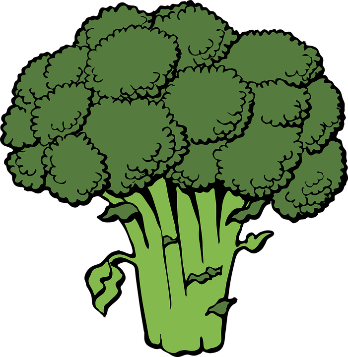

*Project was developed within 24 hours, during BGC Platinion hackathon in Amsterdam, 28-29.10.2022.*

**Introduction**

Did you know that UN estimated in 2022 that nearly half of the fruits and vegetables produced worldwide are wasted each year? We believe that our app can help reduce this number drastically. And did you know that food waste is responsible for around 10% of greenhouse gas emissions? This is exactly what we want to fix. 

How? We are going to make much better use of the fruit and vegetables that expires in the grocery stores. With the already existing app called too-good-go they are not making their boxes of food personalised for the customers, so it turns out that most of that food is thrown out anyways. Therefore, we have designed an app that can scan an image of the fruits, then it automatically uploads exactly what is in the photo to the customer.

The customer has on their side connected their shopping list to the same app, and will get a notification from the grocery stores when anything on their shopping list is added to the foodbox of expired food sold to a much lower price. So it’s not only about the sustainability aspect but has also a great impact on the economical aspect of it.

**Architecture** by Hubert Kołcz

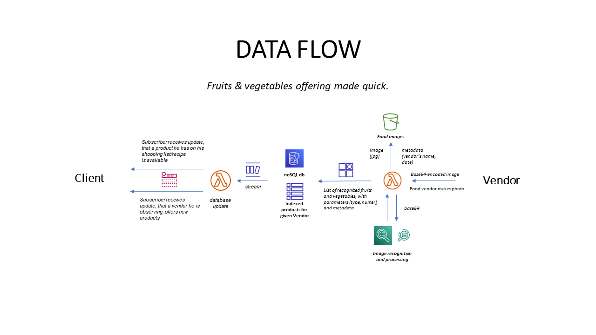
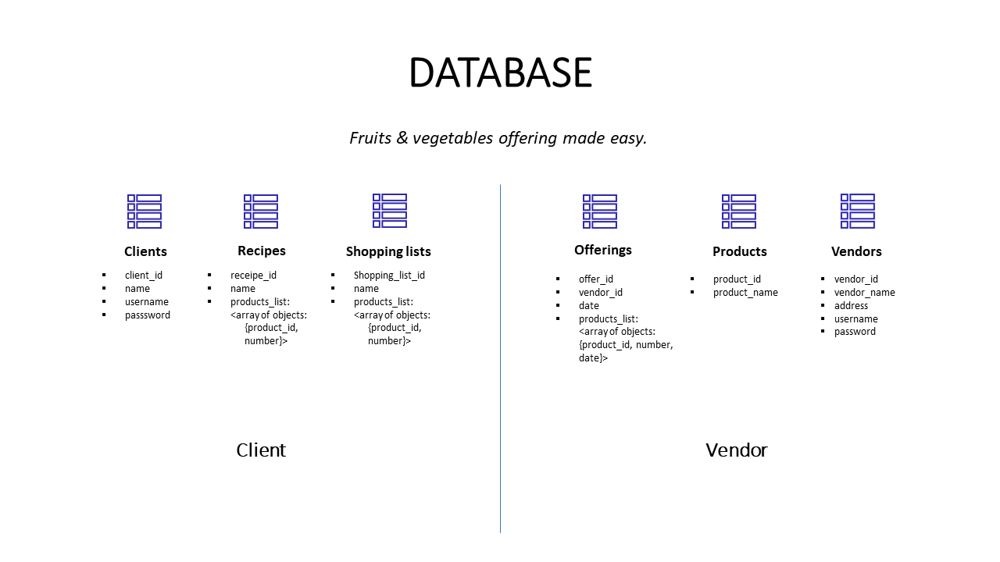
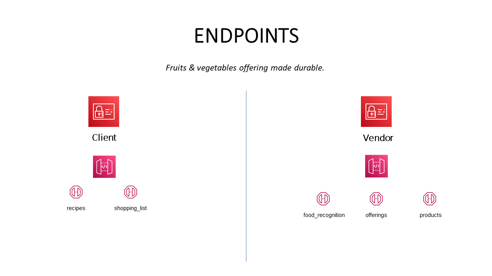

**Client Design** *by Michelle von Huth*

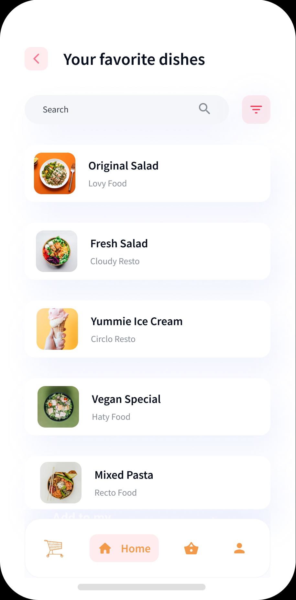
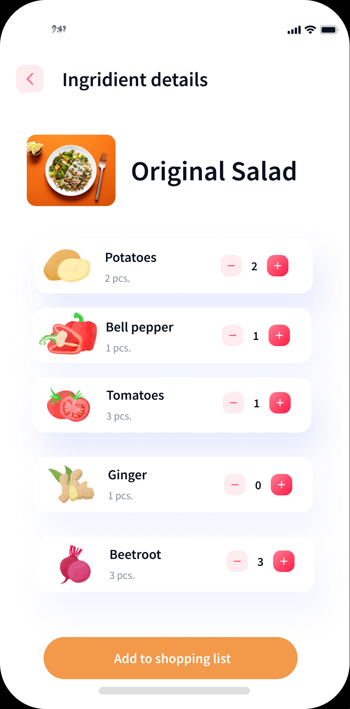
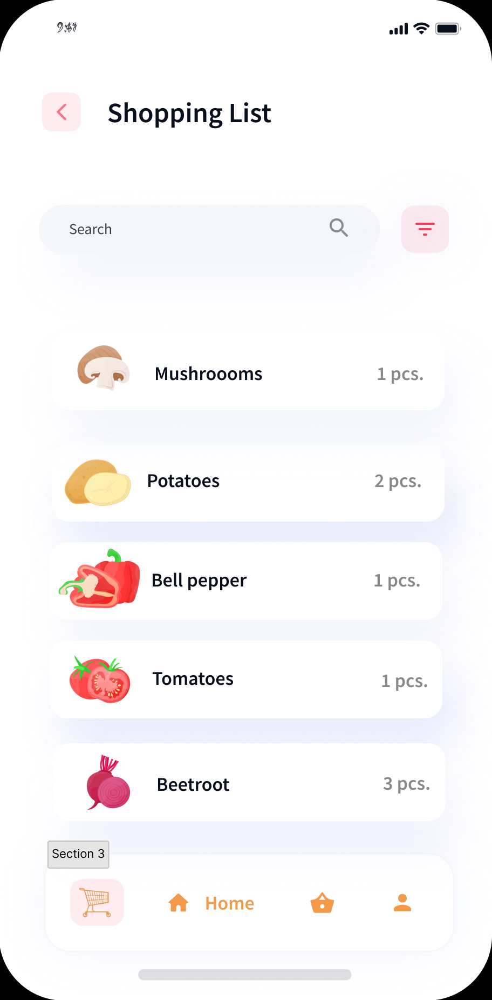
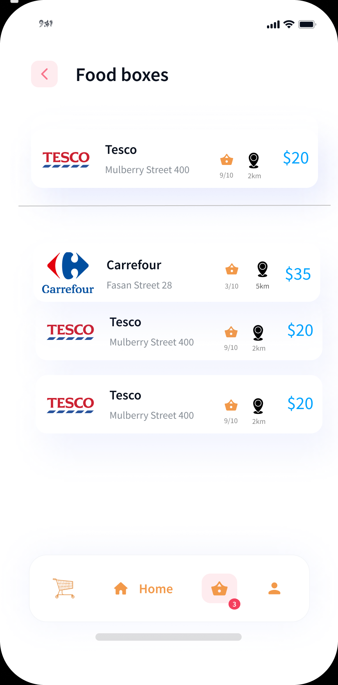
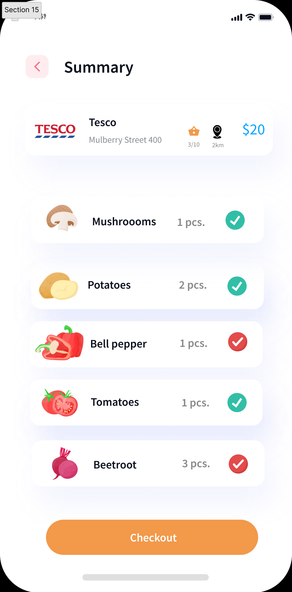

**Vendor Design** 
*by Michelle von Huth*

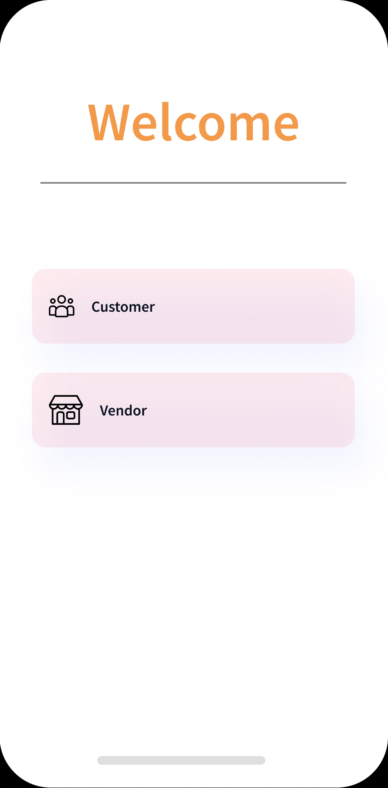
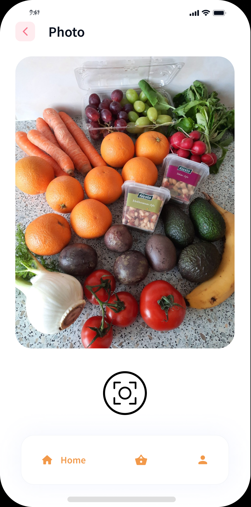
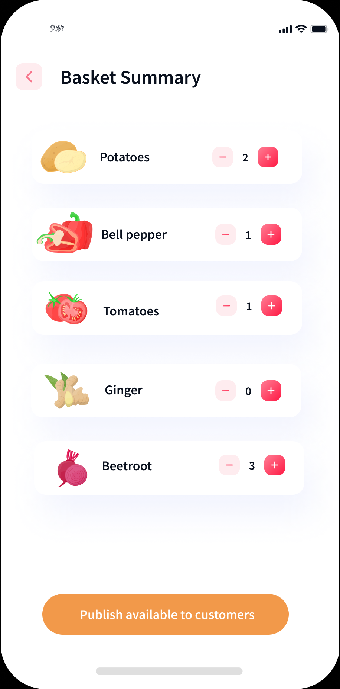
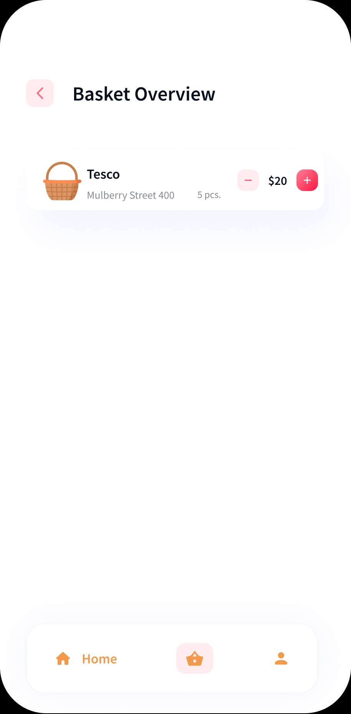

**Endpoints** by Piotr Andziak, Mira Metzeger, and Hubert Kołcz 
*made for the purpose of front-end testing during hackathon, 
instances may be unavailable*

- API for uploading images:
https://b3kuq9tjca.execute-api.eu-central-1.amazonaws.com/v1/rescuethebroccoli/1.jpg

- API for image processing:
https://54ci866nxa.execute-api.eu-central-1.amazonaws.com/default/imgreco
accepts: json - {"baseimg": "/9j/4AAQSkZJRgABAQ(....)"}

- API for uploading and getting data:
https://hr9cixszx9.execute-api.eu-central-1.amazonaws.com/items (GET)
https://hr9cixszx9.execute-api.eu-central-1.amazonaws.com/items (PUT)

**Team**
- Architecture/Cloud: Hubert Kołcz
- Design/Ideation: Michelle von Huth
- Support/Ideation: Paulina Lipska
- Image processing/Cloud: Piotr Andziak & Mira Metzeger

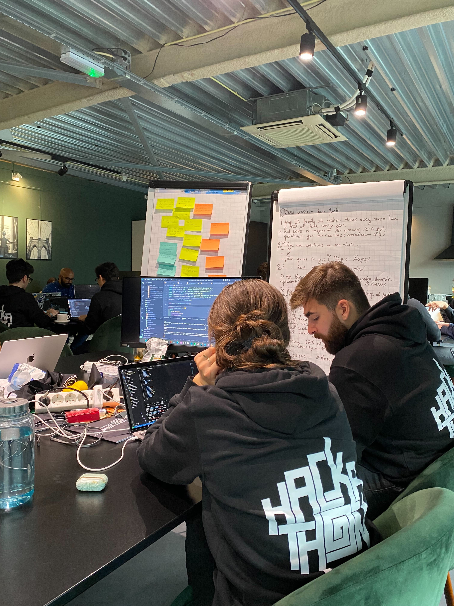
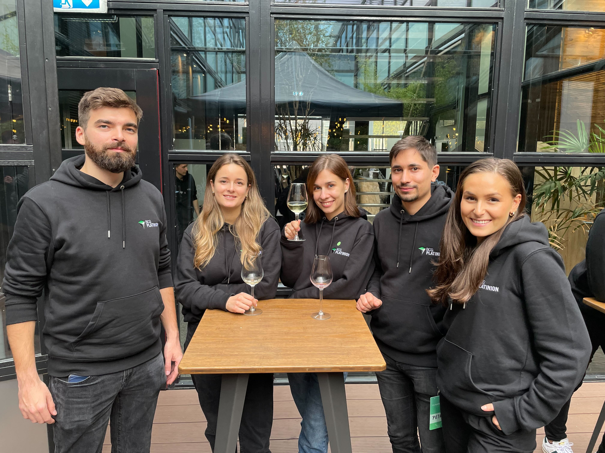
